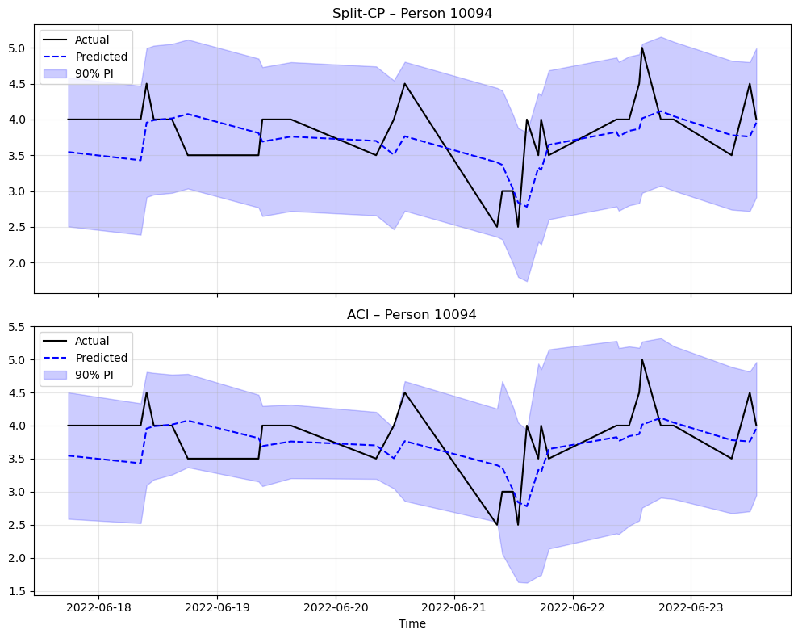
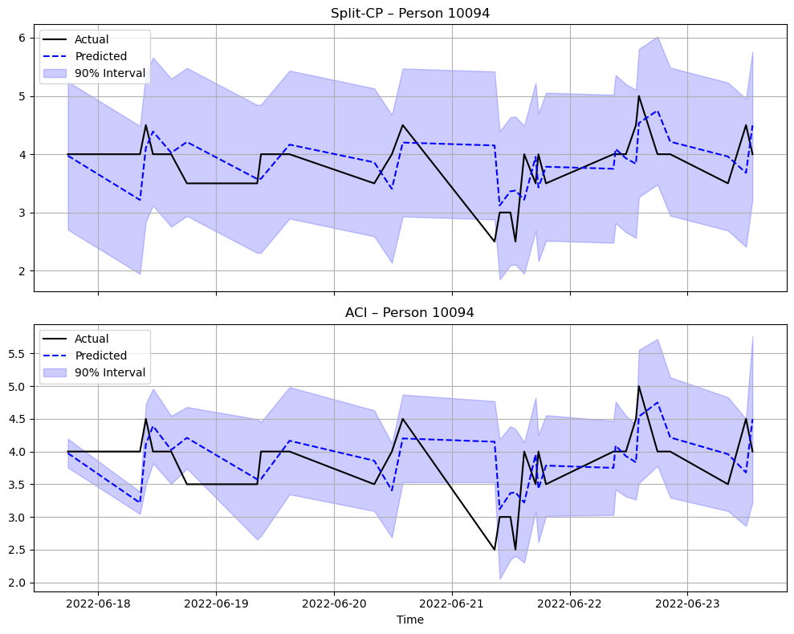
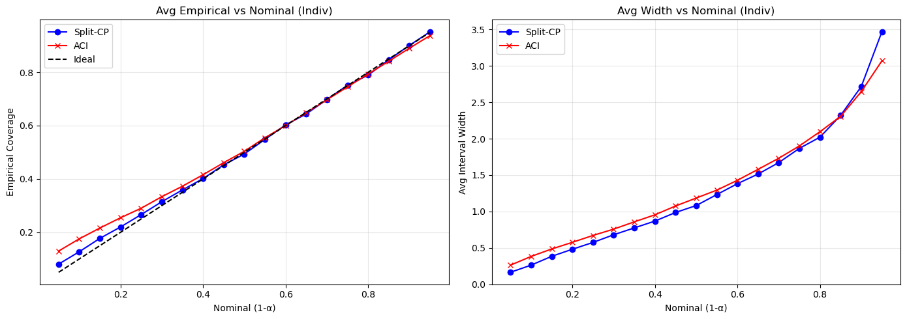
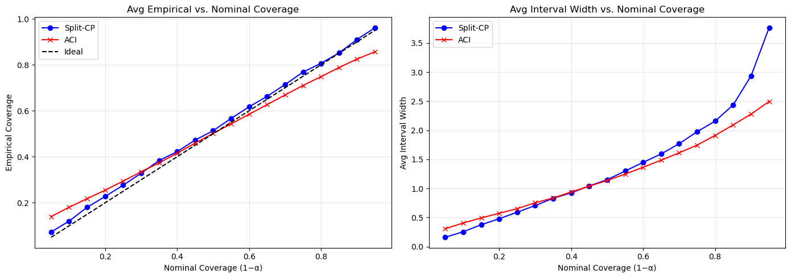

# Conformal Prediction Applied to EMA Data

This project applies conformal prediction to Ecological Momentary Assessment (EMA) data to quantify uncertainty in mood forecasts. It compares personalized (idiographic) and group-based (nomothetic) Random Forest models, with a focus on the trade-off between reliable coverage and informative prediction-interval width.

## Project overview

EMA captures repeated, real-time measurements of emotions, symptoms, and behavior in daily life. The dataset used in this project contains observations from 187 individuals, measured up to eight times per day for 28 days across 12 self-reported variables, including self-esteem, positive and negative affect, perceived control, concentration, worry, and impulsivity.

Random Forest regression is used as the point-forecasting model. Time-of-day and day-of-week features, days since the start of observation, and lagged mood values capture temporal patterns in the EMA measurements.

## Conformal prediction methods

The project implements and compares:

- **Split Conformal Prediction (Split-CP):** uses a fixed residual quantile from a calibration set to create prediction intervals.
- **Adaptive Conformal Inference (ACI):** updates interval width online in response to recent coverage errors and distributional change.
- **Tree-Local Conformal Prediction:** estimates local residual quantiles in covariate regions defined by a small regression tree.
- **Ensemble Bootstrap Prediction Intervals (EnbPI):** combines bootstrap Random Forest forecasts with calibrated residual quantiles.

Each approach is evaluated in two settings:

- **Idiographic:** a separate model is trained and calibrated for each participant.
- **Nomothetic:** one model is trained on pooled data from all participants and calibrated for each individual.

## Evaluation

The forecasting and uncertainty estimates are assessed using:

- Mean Absolute Error (MAE)
- Empirical coverage
- Average prediction-interval width
- Coverage stability over time

The experiments primarily target 90% prediction intervals. Split-CP generally provides coverage closest to the requested level but produces wider intervals. ACI often produces narrower, time-varying intervals, with some under-coverage at higher confidence levels. Tree-Local CP and EnbPI provide intermediate trade-offs between reliability, local adaptivity, and interval sharpness.

## Example: self-esteem forecasting

### Personalized model

The panels compare Split-CP and ACI intervals for one participant. ACI changes its interval width online as new observations arrive.

### Group-based model

The pooled model provides a group-informed forecast, while the conformal procedures quantify uncertainty for the selected participant.

## Coverage-width trade-off

### Personalized models

### Group-based models

## Main findings

- Personalized models better reflect individual mood dynamics but can be unstable when calibration samples are small.
- Group-based models benefit from pooled information but may not capture individual heterogeneity.
- Split-CP is preferable when adherence to nominal coverage is the main priority.
- ACI can produce sharper intervals when some deviation from nominal coverage is acceptable.
- Locally adaptive and bootstrap approaches offer useful middle-ground alternatives.

## Main dependencies

- Python
- NumPy
- pandas
- scikit-learn
- MAPIE
- Matplotlib

## Repository structure

- Analysis notebook or Python scripts
- `images/` - figures used in this README
- `README.md` - project documentation

## Limitations

EMA observations are temporally dependent, irregular, and limited within individuals. These characteristics challenge the exchangeability assumption behind standard conformal prediction. Results can also vary across participants and mood variables, so further validation is needed before applying the methods in practice.

## Disclaimer

This project was developed for academic and research purposes. It is not a clinical forecasting system and should not be used to make mental-health or treatment decisions.
